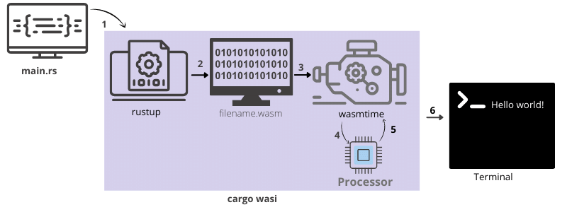

## 

# Rust To Wasm To Non-Browser environment





## Prerequisites
- ### Cargo
  Cargo is Rust's build system and package manager, used to manage `  Rust  ` projects such as building Rust code, downloading and building dependencies.

  </br> Installation </br>

  ```
  sudo apt install cargo
  or
  curl https://sh.rustup.rs -sSf | sh
  ```

- ### Cargo-wasi
  The cargo-wasi is a subcommand for `Cargo` which provides a convenient set of defaults for building and running Rust code on the wasm32-wasi target.

  ```
  cargo wasi build — build our code in debug mode for the wasi target.
  ```
  </br> Installation </br>

  ```
  cargo install cargo-wasi

  ```

- ### wasmtime
  Wasmtime is a runtime for WebAssembly, required because cargo-wasi used it as a default runtime.

  </br> Installation </br>

  ```
  curl https://wasmtime.dev/install.sh -sSf | bash

  ```


 ### Command to create and run a Simple project [Hello](./hello).

 - Create a project name `hello`
 ```
 cargo new hello

 ```
 It will create a folder containing a subfolder ` src ` and a ` toml  ` file having project information such as project name, version, dependencies, etc. while  `  src  ` folder have a rust file `  main.rs ` having a function named ` main  ` with a greeting message `Hello, world!` from where execution get started.

 - Move inside `hello`

  ```
   cd hello
  ```

- Compile and Run Project `hello`
  ```
  cargo wasi run
  ```
  This will compile and run the hello project inside of wasp time automatically.
  We can also run it using `wasmtime` like such:

  ```
  wasmtime target/wasm32-wasi/debug/hello.wasm

  ```


### Other projects
- [Markdown Parser](./markdown_parser)
